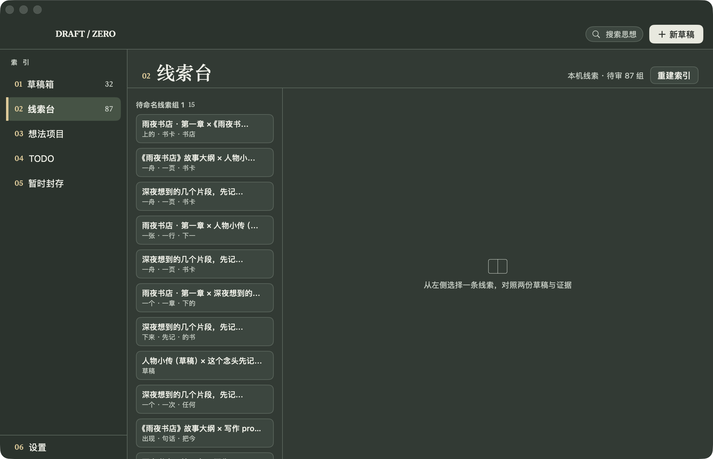
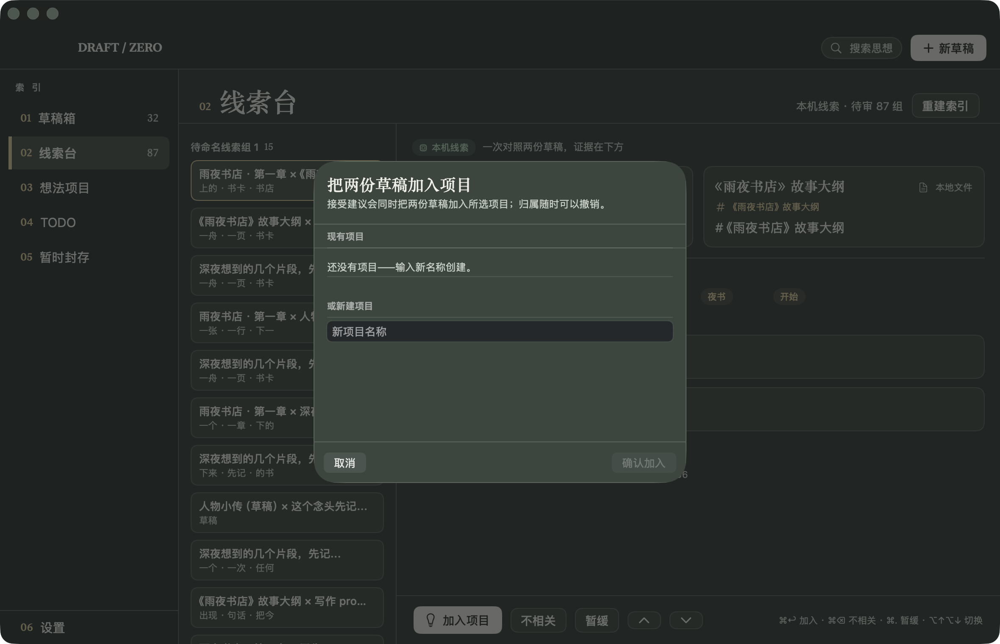

# Draft Zero —— 无限草稿室

**面向独立创作者的 macOS 应用：收纳未完成的想法，把它们归类成可继续推进的项目。**

把散落在各处的草稿、网页、GitHub 文件收进一个完全本机的工作区；离线语义模型自动找出"这些想法可能属于同一个项目"，每条建议都附原文证据，接受与否由你决定。无账号、无云端、无遥测。



## 功能

- **收纳**：拖入 TXT / Markdown / PDF，或粘贴网页与 GitHub 链接；导入逐项报告，重复有提示，原文件永不改动。
- **本机归类建议**：离线 multilingual-e5-small 语义向量 + 字面线索 → 「同一项目线索」与「可能重复」两个待审队列，每条附能定位到原文的证据；接受 / 拒绝 / 暂缓由你决定，拒绝后不再重复打扰。
- **项目整理**：一稿多项目、TODO / 进行中 / 基本完成 / 暂时封存、标签筛选。
- **版本与恢复**：编辑自动留版本（静默 60 秒结算），可对比、可恢复；拆分 / 合并保留双向来路。
- **桌面组件**：TODO 与最近项目常驻桌面，点项目行直达应用，「新建草稿」一步到位。组件与主应用读写同一本机库。



## 系统要求与安装

- **Apple Silicon Mac，macOS 26 或更高**（只含 arm64 切片）。
- V0.1.0 为**未签 Developer ID、未公证**的预览版，首次打开需要一步手动确认：

1. 从 [Releases](https://github.com/GabrielMu2006/DraftZero/releases) 下载 `DraftZero-v0.1.0-arm64.zip`，核对 `SHA256SUMS` 中的 SHA-256；
2. 解压，把 `DraftZero.app` 拖入「应用程序」；
3. 首次打开若被拦：右键点应用 →「打开」；仍被拦则到 **系统设置 → 隐私与安全性**，点「仍要打开」。这是未公证应用的 Apple 官方流程，请不要删除 quarantine 属性或全局关闭 Gatekeeper。

无自动更新；后续版本请回到 Releases 页手动下载。

## 数据与备份

全部数据在本机一个目录里，无账号无云：

```
~/Library/Application Support/DraftZero/   # SQLite 库（含 WAL）+ PDF 快照
```

**完整备份 = 完全退出应用后整体拷贝该目录**；不要只拷单个 `.sqlite` 文件。恢复时原样拷回。

- 桌面组件按 macOS 要求沙盒运行，仅被授权读写上述目录。
- 其他应用可通过 `draftzero://` 深链触发动作；**写入型操作（创建草稿、导入、改状态等）必须经应用内确认弹窗**，拒绝即零写入。
- QA 环境变量 `DZ_WORKSPACE_DIR` 仅用于自动化测试；普通用户不会遇到，界面出现「QA 隔离工作区」横幅时按说明清除即可。

## 隐私

核心归类完全离线；可选的 DeepSeek 分析默认关闭，启用前界面会说明发送范围，Key 只存本机钥匙串。详见 [PRIVACY.md](PRIVACY.md)。第三方组件与模型许可见 [THIRD-PARTY-NOTICES.md](THIRD-PARTY-NOTICES.md)。

## 预览版质量口径（如实说明）

- 30 份**生成集**离线复测：recall@5 = 21/21、prec@3 = 47/63，达到既定门槛；**这是生成集结果，不代表真实资料保证**，独立真实素材的正式验收尚未进行。
- **VoiceOver 朗读体验与减少动态效果开启态未复核**（首版不纳入验收范围，产品决定）。AX 层审计 0 缺陷、减少动态效果代码已适配，但未做真人复核。
- 桌面组件的画廊收录、桌面渲染与「新建草稿」入口已在实机验证；一键状态修改按钮经产品复核后移除，状态修改在主应用完成。
- 已知成本：安装包含离线模型两份（主应用与组件各一），约 281 MB。

完整说明与已知限制见 [RELEASE-NOTES-v0.1.0.md](RELEASE-NOTES-v0.1.0.md)。

## 开发

```bash
# 生成工程（XcodeGen 便携版，无需 Homebrew；Git LFS 需自装，113MB 模型权重走 LFS）
tools/xcodegen/bin/xcodegen generate
open DraftZero.xcodeproj

# 核心测试 / 发布构建（两次全新 DerivedData + 校验 + ZIP + SHA256）
cd Core && swift test
tools/release/build-release.sh
```

要求 Xcode 27（Swift 6.4）。依赖以 `Core/Package.swift` 精确锁定 + `Core/Package.resolved` 为准；不要把本机 `Core/.build` 缓存当作依赖来源（2026-09-29 曾发现该缓存被伪造快照污染并已清除，见 `Core/Package.swift` 注释与 [release-closure/V0.1.0-RELEASE-EVIDENCE.md](release-closure/V0.1.0-RELEASE-EVIDENCE.md)）。

产品与验收规格见 [SPEC.md](SPEC.md)；实施与验证记录见 [IMPLEMENTATION.md](IMPLEMENTATION.md) 与 [ACCEPTANCE.md](ACCEPTANCE.md)；UI 设计出处见 [design-concepts/](design-concepts/)。

## 许可与反馈

- 项目代码**暂未选择开源许可证**（由产品所有者另行决定），未经授权请勿二次分发；随包第三方组件按其原始许可分发（见上文声明）。
- 安装失败、启动崩溃、数据问题请开 [Issue](https://github.com/GabrielMu2006/DraftZero/issues)，附 macOS 版本与复现步骤；数据丢失或误写类问题按最高优先级处理，修复以 `v0.1.1` 发布，不暗换 `v0.1.0` 资产。
