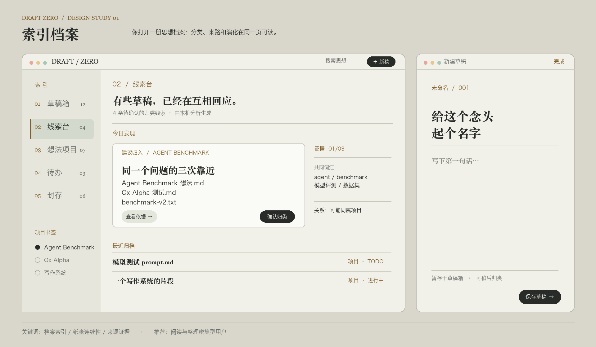
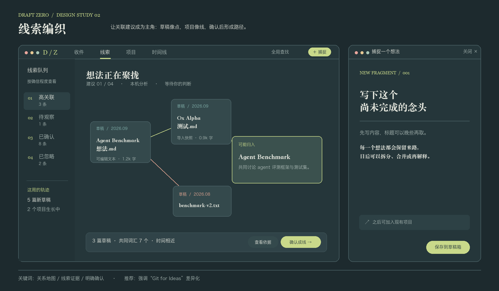
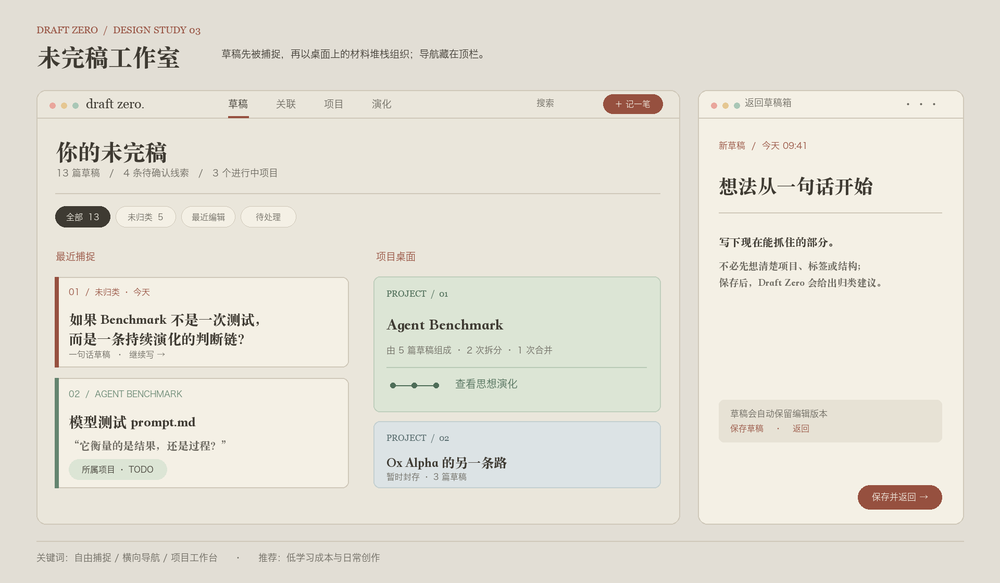
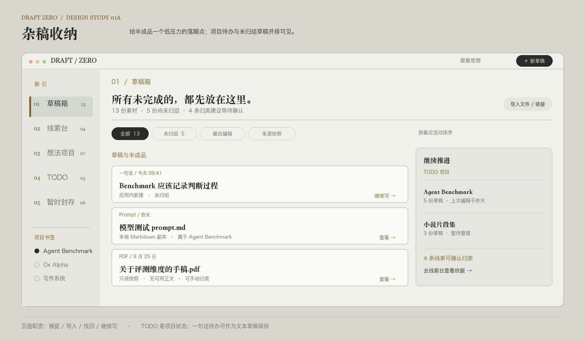
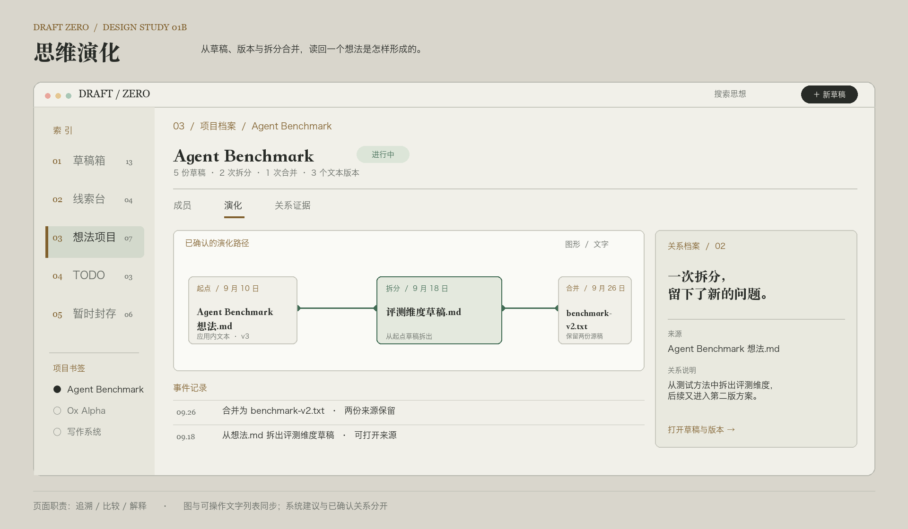

# Draft Zero · 现状评审与三种视觉方向

日期：2026-09-29。评审对象：当前运行中的 macOS 应用；实际查看了草稿箱、新建草稿、草稿详情与编辑、线索台、想法项目和新建项目。下方概念图是设计提案，不是已实现界面。每张图左侧展示主工作区，右侧展示**独立的**新稿屏幕缩小预览；真实应用不需要同时显示两扇窗口。

## 1. 现状：用户感受到的问题来自哪里

| 优先级 | 观察到的现象 | 对任务的影响 | 当前实现线索 |
|---|---|---|---|
| P0 | 打开草稿详情后，草稿箱内容列被挤窄，标题逐字竖排 | 主要导航失去可读性，无法稳定浏览与编辑 | `MainWindowView` 外层 `NavigationSplitView` 里叠加 `HSplitView`，详情面板有较大最小宽度；收起详情依赖窗口尺寸变化 |
| P1 | 左侧导航呈默认 macOS 列表，蓝色选中态和系统符号构成几乎全部识别点 | 看不出“思想档案 / 线索演化”的产品主题 | `SidebarView` 使用 `List(...).listStyle(.sidebar)` |
| P1 | 深色主工作区与几乎纯白的卡片、编辑面同时出现 | 阅读时亮度跃迁大，界面像两套主题拼接 | `Theme.swift` 的 `workbench` 与 `paper` 差距大，`PaperSurface` 强制浅色子树 |
| P1 | 新建草稿是固定尺寸的通用表单弹层：标题框、说明、空白文本框、底部按钮 | 创作入口缺乏沉浸感；标题先于内容，暗示草稿需要“写完整” | `NewDraftSheet` 固定 560 × 420 point，表单式布局 |
| P2 | 草稿箱顶栏多枚同级按钮；线索台与项目空状态留出大片没有任务提示的区域 | 主操作不够明确，空状态难以把用户带入“导入—归类—确认” | `DraftBoxView`、`ClueDeskView`、`ProjectsView` |

上面的 P0 是布局缺陷，应先修复，不依赖采用哪版视觉方向。P1 是本次设计的核心范围。

## 2. 统一的设计边界

- **分类是首要任务**：首页应回答“哪些草稿还没归类”“系统建议它们属于哪里”“依据是什么”“我如何确认或拒绝”。关系图不能取代可扫描的队列和证据。
- **允许不完整**：创建草稿时可以直接写内容，标题可为空；保存后留在草稿箱，稍后再归类。界面不要用长表单和必填字段暗示完成度。
- **状态属于想法项目**：TODO、进行中、基本完成、暂时封存只出现在项目或“所属项目状态”的语境中；草稿自身不被误标为这些状态。
- **建议由用户确认**：线索和相似度必须明确标为建议；项目归属、拆分、合并由用户操作。每条建议至少能查看来源草稿与原因。
- **关系可追溯**：项目页能打开草稿来源、编辑版本、拆分/合并记录。不能把装饰性连线当作唯一说明。
- **视觉与交互一起设计**：所有方向都保留键盘导航、可见焦点、可读文字、清晰的取消/返回、窗口缩小时的重排。正文及操作文字至少达到 4.5:1 的对比度目标。

## 3. 概念 01：索引档案

**主题**：资料室里的检索目录。信息不是散落的白卡，而是编号、主题、来路与证据组成的一页档案。

- **导航**：窄“索引脊背”，使用 01–05 编号、细线与项目书签。选中态靠纸色变化和竖线，不依赖系统蓝色列表行。
- **工作区**：左主栏列出待确认建议，右边是直接可见的证据。主操作是“确认归类”；查看依据为次操作。
- **新稿**：进入同一材质的独立写作屏幕。大标题位置、正文位置、保存入口依阅读顺序展开；标题可以空着。
- **用色**：纸 `#F1F0E9`、脊背 `#E7E6DC`、深墨 `#282B27`、索引棕 `#80602D`。用相邻明度分层，避免黑白拼贴。
- **适合**：大量文档检索、需要持续核对归类依据的用户。风险是品牌辨识度更安静，关系演化需要一个专门的二级视图展示。

## 4. 概念 02：线索编织

**主题**：正在形成的思想路径。草稿是材料节点，项目是用户确认后的线。

- **导航**：一级任务移到顶部：收件、线索、项目、时间线。左侧窄列只显示当前“线索”任务的队列，不再是贯穿全应用的系统侧栏。
- **工作区**：中心展示当前一组候选草稿与目标项目，底部固定“查看依据 / 确认成线”。建议连线与已确认关系要用不同线型、文字和状态说明；不能只靠颜色。
- **新稿**：“捕捉”打开专注写作屏幕，先写内容、标题后补；保存后进入收件队列，不强迫当场选项目。
- **用色**：深青灰 `#25363A`、层次面板 `#2D4145`、浅字 `#E4E6DD`、线索黄绿 `#C9D98A`、待观察珊瑚 `#E7A894`。所有深色界面保持接近的明度层级。
- **适合**：最能体现 “Git for Ideas” 的关系与演化。**风险**：节点多时会杂乱，不能把地图作为唯一归类方式。必须同步提供可排序的线索列表、键盘可达的卡片和窄窗口布局。

## 5. 概念 03：未完稿工作室

**主题**：可以随手记、随手整理的创作桌面。草稿是材料，项目是并排生长的工作区。

- **导航**：顶栏切换草稿、关联、项目、演化，去掉常驻侧栏。筛选器只在草稿页出现。
- **工作区**：最近捕捉与项目桌面并列，让“这篇尚未归类”和“这个项目还在生长”同时可见。项目状态放在项目卡中；草稿卡只有来源和所属项目说明。
- **新稿**：整页无表单感的写作入口。先写一句话，给出保存、返回与版本提示；不要求在创建时理解所有归类功能。
- **用色**：工作台 `#EAE6DB`、奶油纸 `#F4F0E5`、主文字 `#3E3A32`、赭红 `#96503F`、柔和鼠尾草绿 `#DCE5D5`。层级由材质与排版形成。
- **适合**：每天频繁捕捉想法的独立创作者。风险是“智能归类”露出较少，首页必须持续显示待确认线索数量与入口。

## 6. 已选方向与补充页面

2026-09-29，用户已选定 **01「索引档案」** 为整套应用 UI 方向，并明确它要同时承载“杂稿/半成品/TODO 念头的收纳”和“思维演变、关联的回看”。02 与 03 保留为早期探索，不作为实施视觉依据。

三个 01 系列概念图分别展示线索审核与新稿、草稿箱收纳、项目演化。完整逐屏交互、响应式规则、实施包和验收矩阵以仓库根目录 [UI-REDESIGN-PLAN.md](../UI-REDESIGN-PLAN.md) 为准。概念图不是实际应用截图，也不代表页面元素必须按图中示例数量与像素机械实现。
